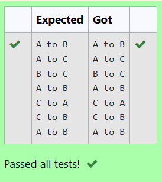

# EX1C Implementation of Tower of Hanoi
## DATE: 26/02/2025
## AIM:
To write a C program to implement Tower of Hanoi

## Algorithm
1. Start the program.
2. Include the required libraries.
3. Define a recursive function to handle the tower of hanoi problem.
4. Call the defined function in the main function and print the moves.
5. End the program.

## Program:
```
/*
Program to implement Tower of Hanoi
Developed by: DINESHKARTHIK N 
RegisterNumber: 212223220021  
*/

#include<stdio.h>
void TOH(int n,char x,char y,char z)
{
  if(n>0)
  {
      TOH(n-1,x,z,y);
      printf("%c to %c",x,y);
      printf("\n");
      TOH(n-1,z,y,x);
  }
}
int main()
{
    int n=3;
    TOH(n,'A','B','C');
}
```

## Output:


## Result:
Thus, the C program to implement Tower of Hanoi using recursion is implemented successfully.
