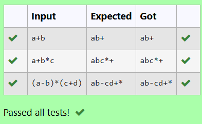

# Ex1B Conversion of the infix expression into postfix expression
## DATE: 21/02/2025
## AIM:
To write a C program to convert the infix expression into postfix form using stack by following the operator precedence and associative rule.

## Algorithm
1. Start the program.
2. Include the required libraries.
3. Define functions for push and pop operations to handle the stack and define a function to return the priority of the operators.
4. Construct the function to convert an infix expression into postfix following the logic.
5. End the program.   

## Program:
```
/*
Program to convert the infix expression into postfix expression
Developed by: DINESHKARTHIK N 
RegisterNumber: 212223220021  
*/

#include<stdio.h>
char stack[100];
int top = -1;

void push(char x)
{
   top=top+1;
   stack[top]=x;
}

char pop()
{

   return stack[top--];
   
}
```

## Output:


## Result:
Thus, the C program to convert the infix expression into postfix form using stack by following the operator precedence and associative rule is implemented successfully.