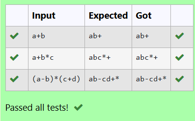

# Ex1E Stack Operations
## DATE: 28/02/2025
## AIM:
To write a C function to perform push and pop operation of the stack in the infix to postfix conversion.

## Algorithm
1. Start the program.
2. Include the required libraries.
3. Define a function to perform push operation of a stack by incrementing the top pointer.
4. Define a function to perform pull operation of a stack by decrementing the top pointer and returning the element before decrementing.
5. End the program.

## Program:
```
/*
Program to find and display the priority of the operator in the given Postfix expression
Developed by: DINESHKARTHIK N 
RegisterNumber: 212223220021  
*/

#include<stdio.h>

char stack[100];
int top = -1;

void push(char x)
{
   stack[++top]=x;
}

char pop()
{
   if(top==-1)
   return -1;
   else
   return stack[top--];
}
```

## Output:


## Result:
Thus the C program to perform push and pop operation of the stack in the infix to postfix conversion is implemented successfully.
